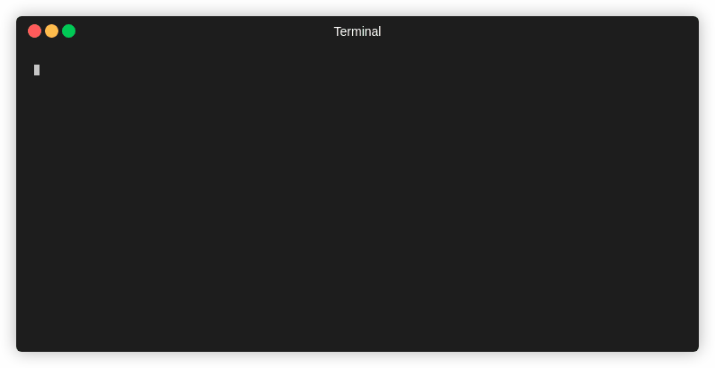

---

[](https://goreportcard.com/report/github.com/kjcodeacct/pwsync)
[](https://cloud.drone.io/kjcodeacct/pwsync)

# Table of Contents

- [Table of Contents](#table-of-contents)
- [Overview](#overview)
  - [Note](#note)
- [Quick Start](#quick-start)
- [Installing & Usage](#installing--usage)
    - [Binary Releases](#binary-releases)
    - [Go Get](#go-get)
  - [Building](#building)
    - [Binaries](#binaries)
    - [CI/CD](#cicd)
- [Support OS](#support-os)
- [Supported Password Platforms](#supported-password-platforms)
- [Dependencies](#dependencies)

# Overview
Pwsync is a convenient password backup tool to help with the following:

* Backup proprietary password vaults into an encrypted [keepass](https://keepass.info/index.html) database.


If you work with multiple password systems, or want backups of system critical passwords, this could be for you.

## Note
Please see the list of [supported password platforms](#supported-password-platforms).

**ALL** interaction with a password service is done with it's native command line application, pwsync **does not** make API calls directly to a password service. This is enables far more flexibility and reduces security issues.

# Quick Start

First install your password services CLI application.
* See links available in [supported password platforms](#supported-password-platforms).

Next initialize your working directory.
```
$ pwsync init --platform=bitwarden
```

Login to your password service
```
$ pwsync login
```

Fetch any updates from you password service
```
$ pwsync fetch
```


Pull and backup your latest passwords
```
$ pwsync pull
```

Once a backup has been created, feel free to logout
```
$ pwsync logout
```

---



---
# Installing & Usage

### Binary Releases
Binary releases are available in the github releases page found [here](https://github.com/kjcodeacct/pwsync/releases)

### Go Get
golang 1.14+ is required
set GO111MODULE=on

```
$ go get -u github.com/kjcodeacct/pwsync
```

## Building


### Binaries
If you would like to manually build binaries available in the [releases page](https://github.com/kjcodeacct/pwsync/releases), run the following.
```
$ make binaries
```

### CI/CD
If you want to view steps used by <drone.io> for automated builds please view [.drone.yml](.drone.yml)


# Support OS
Currently pwsync is limited to the following Operating Systems:

* Linux
* BSD
* Mac/Darwin

Unfortunately there is currently no windows support, as this application requires pseudo terminals, and the current package in use 'pty' does not support windows.
If you are an avid windows user and want to add this feature, please [publish a pull request](https://github.com/kjcodeacct/pwsync/pulls).

# Supported Password Platforms

* [Bitwarden](https://bitwarden.com/)
  * [Bitwarden CLI application](https://bitwarden.com/help/article/cli/)
* [Lastpass](https://www.lastpass.com/)
  * [Lastpass CLI application](https://github.com/lastpass/lastpass-cli)

If a password service you use is not availble please feel free to:
* [Create an issue](https://github.com/kjcodeacct/pwsync/issues)
* [Publish a pull request](https://github.com/kjcodeacct/pwsync/pulls)

# Dependencies
Golang version 1.14+
Unix based system (Linux, Mac, BSD, etc)